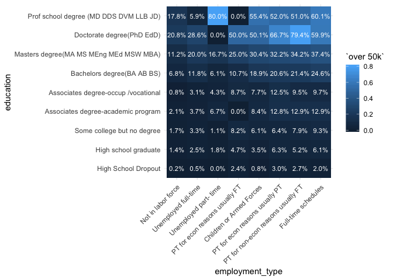

Exploratory Data Analysis
================
Denis Maciel
03/03/2019

First, read in the train dataset. The column names are missing, so we
need to extract them from the documentation
(`./us_census_full/census_income_metadata.txt`)

``` r
library(tidyverse)
library(here)

col_string <- glue::glue("
|   91 distinct values for attribute #0 (age) continuous
|    9 distinct values for attribute #1 (class of worker) nominal
|   52 distinct values for attribute #2 (detailed industry recode) nominal
|   47 distinct values for attribute #3 (detailed occupation recode) nominal
|   17 distinct values for attribute #4 (education) nominal
| 1240 distinct values for attribute #5 (wage per hour) continuous
|    3 distinct values for attribute #6 (enroll in edu inst last wk) nominal
|    7 distinct values for attribute #7 (marital stat) nominal
|   24 distinct values for attribute #8 (major industry code) nominal
|   15 distinct values for attribute #9 (major occupation code) nominal
|    5 distinct values for attribute #10 (race) nominal
|   10 distinct values for attribute #11 (hispanic origin) nominal
|    2 distinct values for attribute #12 (sex) nominal
|    3 distinct values for attribute #13 (member of a labor union) nominal
|    6 distinct values for attribute #14 (reason for unemployment) nominal
|    8 distinct values for attribute #15 (full or part time employment stat) nominal
|  132 distinct values for attribute #16 (capital gains) continuous
|  113 distinct values for attribute #17 (capital losses) continuous
| 1478 distinct values for attribute #18 (dividends from stocks) continuous
|    6 distinct values for attribute #19 (tax filer stat) nominal
|    6 distinct values for attribute #20 (region of previous residence) nominal
|   51 distinct values for attribute #21 (state of previous residence) nominal
|   38 distinct values for attribute #22 (detailed household and family stat) nominal
|    8 distinct values for attribute #23 (detailed household summary in household) nominal
|    (instance weight)
|   10 distinct values for attribute #24 (migration code-change in msa) nominal
|    9 distinct values for attribute #25 (migration code-change in reg) nominal
|   10 distinct values for attribute #26 (migration code-move within reg) nominal
|    3 distinct values for attribute #27 (live in this house 1 year ago) nominal
|    4 distinct values for attribute #28 (migration prev res in sunbelt) nominal
|    7 distinct values for attribute #29 (num persons worked for employer) continuous
|    5 distinct values for attribute #30 (family members under 18) nominal
|   43 distinct values for attribute #31 (country of birth father) nominal
|   43 distinct values for attribute #32 (country of birth mother) nominal
|   43 distinct values for attribute #33 (country of birth self) nominal
|    5 distinct values for attribute #34 (citizenship) nominal
|    3 distinct values for attribute #35 (own business or self employed) nominal
|    3 distinct values for attribute #36 (fill inc questionnaire for veteran's admin) nominal
|    3 distinct values for attribute #37 (veterans benefits) nominal
|   53 distinct values for attribute #38 (weeks worked in year) continuous
|    2 distinct values for attribute #39 (year) nominal")

col_names <- col_string %>%
  str_split("\\n") %>% 
  .[[1]] %>% 
  str_extract("\\((.*?)\\)") %>% 
  str_remove_all("\\(|\\)|'") %>% 
  str_replace_all(" ", "_")

col_names <- c(col_names, "income")

train_raw <- readr::read_csv(here("us_census_full/census_income_learn.csv"), 
                             col_names = col_names, 
                             na = "?") 
train <- train_raw %>% 
  mutate(id = row_number(),
         income = ifelse(income == "- 50000.", "under 50k", "over 50k"))
```

## Task

The aim of this analysis is to develop a model for a binary
classification. The model needs to tell apart respondents that earn more
than 50k (high income earners) from respondents who earn less than 50k
(low income earners). `income` is the target variable in the data set.

Note that the target variable is imbalanced: we have 94% of respondents
who make less than 50k.

``` r
train %>% 
  count(income) %>% 
  mutate(pp = n/sum(n) * 100)
```

    ## # A tibble: 2 x 3
    ##   income         n    pp
    ##   <chr>      <int> <dbl>
    ## 1 over 50k   12382  6.21
    ## 2 under 50k 187141 93.8

## Missing Values

Before diving into the data, it’s important to assess the quality of the
data we have at our disposal.

``` r
skm <- skimr::skim(train) 
skm
```

    ## Skim summary statistics
    ##  n obs: 199523 
    ##  n variables: 43 
    ## 
    ## ── Variable type:character ──────────────────────────────────────────────────────
    ##                                   variable missing complete      n min max
    ##                                citizenship       0   199523 199523  33  43
    ##                            class_of_worker       0   199523 199523   7  30
    ##                    country_of_birth_father    6713   192810 199523   4  28
    ##                    country_of_birth_mother    6119   193404 199523   4  28
    ##                      country_of_birth_self    3393   196130 199523   4  28
    ##         detailed_household_and_family_stat       0   199523 199523  11  47
    ##    detailed_household_summary_in_household       0   199523 199523  11  36
    ##                                  education       0   199523 199523   8  38
    ##                 enroll_in_edu_inst_last_wk       0   199523 199523  11  21
    ##                    family_members_under_18       0   199523 199523  15  22
    ##  fill_inc_questionnaire_for_veterans_admin       0   199523 199523   2  15
    ##          full_or_part_time_employment_stat       0   199523 199523  18  34
    ##                            hispanic_origin       0   199523 199523   2  25
    ##                                     income       0   199523 199523   8   9
    ##              live_in_this_house_1_year_ago       0   199523 199523   2  32
    ##                        major_industry_code       0   199523 199523   6  35
    ##                      major_occupation_code       0   199523 199523   5  37
    ##                               marital_stat       0   199523 199523   7  31
    ##                    member_of_a_labor_union       0   199523 199523   2  15
    ##               migration_code-change_in_msa   99696    99827 199523   8  16
    ##               migration_code-change_in_reg   99696    99827 199523   6  30
    ##             migration_code-move_within_reg   99696    99827 199523   6  28
    ##              migration_prev_res_in_sunbelt   99696    99827 199523   2  15
    ##                                       race       0   199523 199523   5  27
    ##                    reason_for_unemployment       0   199523 199523  10  21
    ##               region_of_previous_residence       0   199523 199523   4  15
    ##                                        sex       0   199523 199523   4   6
    ##                state_of_previous_residence     708   198815 199523   4  20
    ##                             tax_filer_stat       0   199523 199523   6  28
    ##  empty n_unique
    ##      0        5
    ##      0        9
    ##      0       42
    ##      0       42
    ##      0       42
    ##      0       38
    ##      0        8
    ##      0       17
    ##      0        3
    ##      0        5
    ##      0        3
    ##      0        8
    ##      0       10
    ##      0        2
    ##      0        3
    ##      0       24
    ##      0       15
    ##      0        7
    ##      0        3
    ##      0        9
    ##      0        8
    ##      0        9
    ##      0        3
    ##      0        5
    ##      0        6
    ##      0        6
    ##      0        2
    ##      0       50
    ##      0        6
    ## 
    ## ── Variable type:integer ────────────────────────────────────────────────────────
    ##  variable missing complete      n  mean       sd p0     p25   p50      p75
    ##        id       0   199523 199523 99762 57597.47  1 49881.5 99762 149642.5
    ##   p100     hist
    ##  2e+05 ▇▇▇▇▇▇▇▇
    ## 
    ## ── Variable type:numeric ────────────────────────────────────────────────────────
    ##                         variable missing complete      n    mean      sd
    ##                              age       0   199523 199523   34.49   22.31
    ##                    capital_gains       0   199523 199523  434.72 4697.53
    ##                   capital_losses       0   199523 199523   37.31  271.9 
    ##         detailed_industry_recode       0   199523 199523   15.35   18.07
    ##       detailed_occupation_recode       0   199523 199523   11.31   14.45
    ##            dividends_from_stocks       0   199523 199523  197.53 1984.16
    ##                  instance_weight       0   199523 199523 1740.38  993.77
    ##  num_persons_worked_for_employer       0   199523 199523    1.96    2.37
    ##    own_business_or_self_employed       0   199523 199523    0.18    0.55
    ##                veterans_benefits       0   199523 199523    1.51    0.85
    ##                    wage_per_hour       0   199523 199523   55.43  274.9 
    ##             weeks_worked_in_year       0   199523 199523   23.17   24.41
    ##                             year       0   199523 199523   94.5     0.5 
    ##     p0     p25     p50     p75    p100     hist
    ##   0      15      33      50       90   ▇▆▇▇▅▃▃▁
    ##   0       0       0       0    99999   ▇▁▁▁▁▁▁▁
    ##   0       0       0       0     4608   ▇▁▁▁▁▁▁▁
    ##   0       0       0      33       51   ▇▁▁▁▁▂▂▁
    ##   0       0       0      26       46   ▇▁▁▁▁▂▁▁
    ##   0       0       0       0    99999   ▇▁▁▁▁▁▁▁
    ##  37.87 1061.62 1618.31 2188.61 18656.3 ▇▂▁▁▁▁▁▁
    ##   0       0       1       4        6   ▇▂▁▁▁▁▁▃
    ##   0       0       0       0        2   ▇▁▁▁▁▁▁▁
    ##   0       2       2       2        2   ▂▁▁▁▁▁▁▇
    ##   0       0       0       0     9999   ▇▁▁▁▁▁▁▁
    ##   0       0       8      52       52   ▇▁▁▁▁▁▁▆
    ##  94      94      94      95       95   ▇▁▁▁▁▁▁▇

### Missing values do we have per column?

  - Only 8 columns have missing values at all.
  - Missing values are mostly related to geographic origin of
    respondent.
  - Columns starting with “migration\_” have close to 50% of missing
    data. For the sake of simplicity, we won’t consider them when
    modeling.

<!-- end list -->

``` r
skm %>% 
  as_tibble() %>% 
  filter(stat == "missing") %>% 
  arrange(desc(value))
```

    ## # A tibble: 43 x 6
    ##    variable                       type      stat    level value formatted
    ##    <chr>                          <chr>     <chr>   <chr> <dbl> <chr>    
    ##  1 migration_code-change_in_msa   character missing .all  99696 99696    
    ##  2 migration_code-change_in_reg   character missing .all  99696 99696    
    ##  3 migration_code-move_within_reg character missing .all  99696 99696    
    ##  4 migration_prev_res_in_sunbelt  character missing .all  99696 99696    
    ##  5 country_of_birth_father        character missing .all   6713 6713     
    ##  6 country_of_birth_mother        character missing .all   6119 6119     
    ##  7 country_of_birth_self          character missing .all   3393 3393     
    ##  8 state_of_previous_residence    character missing .all    708 708      
    ##  9 age                            numeric   missing .all      0 0        
    ## 10 class_of_worker                character missing .all      0 0        
    ## # … with 33 more rows

### Distribution of numerical variables

  - `own_business_or_self_employed` and `veterans_benefits` are in fact
    categorical variables encoded as numeric.
  - For high income, `weeks_worked_in_year` is very concentrated around
    52 worked weeks (1st quartile, median and 3rd quartile are all 52
    weeks). Or, from another angle, everything below 52 weeks is
    considered by the boxplot as an outlier. For low income, the 1st
    quartile worked 0 week, while the 3rd quartile worked 52 weeks, with
    the median number of worked weeks lying somewhere around 43 weeks.
  - `wage_per_hour`, `capital_losses`,
    `dividends_from_stock`,`capital_gains` are all highly skewed to the
    right. We mitigate the skewness by log-transforming them.

<!-- end list -->

``` r
numeric_cols <- train %>% 
  map_lgl(is.numeric) %>% 
  which()

train %>% 
  filter(age > 16) %>% 
  select(numeric_cols, income, -id, -instance_weight, -ends_with("_recode")) %>% 
  gather(key, value, -income) %>% 
  ggplot(aes(income, value)) + 
  geom_boxplot(alpha = 0.3) +
  facet_wrap(~ key, scales = "free_y")
```

<!-- -->

### Age & Sex

Age and sex are very important features:

  - In fact, if the respondent is younger than 16, we can be sure that
    she is a low income earner. **When training a model, we will remove
    respondents under 16. When predicting on unseen data, we will
    manually assign the low income class to respondents that are under
    16**. By doing so, we make our model less complex and faster to
    train.
  - Males have on average higher income than females.
  - Respondents with high income concentrate around 40 years for both
    sex..

<!-- end list -->

``` r
theme_set(theme_minimal())

breaks <- c(seq(-0.01, 90, by = 3), 100)
labels <- paste(
  round(breaks[-length(breaks)]),
  round(breaks[-1]),
  sep= " - "
)
test <- train %>% 
  transmute(
    age_bucket = cut(age, breaks = breaks, labels = labels),
    sex_income = paste(sex, income) %>% fct_rev,
    sex)
test %>% 
  ggplot(aes(x = age_bucket)) + 
  geom_bar(data = filter(test, sex == "Female"),
           aes(fill = sex_income)) + 
  geom_bar(data = filter(test, sex == "Male"),
           aes(fill = sex_income, y = ..count.. * (-1))) + 
  scale_fill_manual(values = c("#93628A", "#B48EAD", "#34506C", "#80A1C1")) +
  scale_y_continuous(breaks = seq(-5000, 5000, 1000),
                     labels = abs(seq(-5000, 5000, 1000))) + 
  coord_flip() +
  labs(title = "Population Pyramid",
       subtitle = "High earners distribution marked by darker shade",
       fill = NULL,  
       y = NULL,
       x = NULL)
```

<!-- -->

### Education

Education is also an important factor when comes to predicting income:

  - As one might have expected, higher level of education are deeply
    associated with high incomes.
  - 100% of Children are low income, which speaks in favor of the
    consistency of the data. As we had seen before, all respondents
    under 16 also low income.
  - It’s interesting to notice that there is **very low variation in the
    percentage of high income across respondents that haven’t completed
    high school.** No matter if you have completed up to the 4th or 12th
    grade, chances are extremely high you make less than 50k a year.
    There is probably high variation within these buckets,
    i.e. respondetns that completed, say, the 10th grade probably have
    a significantly higher median salary than respondents with the 4th
    grade only. But since they both make less than 50k, they are grouped
    in the same bucket.

<!-- end list -->

``` r
train %>% 
  count(education, income, sort = TRUE) %>% 
  group_by(education) %>% 
  mutate(pp = n/sum(n)) %>%
  # Order education according to % of high income
  ungroup() %>% 
  select(-n) %>% 
  spread(income, pp, fill = 0) %>% 
  mutate(education = fct_reorder(education, `over 50k`)) %>% 
  gather(income, pp, -education) %>% 
  # End order education
  ggplot(aes(education, pp, fill = income)) +
  geom_col() +
  scale_y_continuous(labels = scales::percent_format()) +
  coord_flip() +
  labs(title  = "% of high and low income across education level",
       subtitle = "Education levels are ordered according to % of high income",
       fill = NULL,
       x = NULL,
       y = NULL)
```

<!-- -->

### Ethinicity

``` r
train %>% 
  count(race, income, sort = TRUE) %>% 
  group_by(race) %>% 
  mutate(pp = n/sum(n)) %>%
  # Order education according to % of high income
  ungroup() %>% 
  select(-n) %>% 
  spread(income, pp, fill = 0) %>% 
  mutate(race = fct_reorder(race, `over 50k`)) %>% 
  gather(income, pp, -race) %>% 
  # End order education
  ggplot(aes(race, pp, fill = income)) +
  geom_col() +
  scale_y_continuous(labels = scales::percent_format()) +
  coord_flip() +
  labs(title  = "% of high and low income across education level",
       subtitle = "Races are ordered according to % of high income",
       fill = NULL,
       x = NULL,
       y = NULL)
```

<!-- -->

### Citizenship

``` r
train %>% 
  count(citizenship, income, sort = TRUE) %>% 
  spread(income, n) %>% 
  mutate(pp_over_50k = 100 * `over 50k`/(`over 50k` + `under 50k`))
```

    ## # A tibble: 5 x 4
    ##   citizenship                            `over 50k` `under 50k` pp_over_50k
    ##   <chr>                                       <int>       <int>       <dbl>
    ## 1 Foreign born- Not a citizen of U S            492       12909        3.67
    ## 2 Foreign born- U S citizen by naturali…        580        5275        9.91
    ## 3 Native- Born abroad of American Paren…        128        1628        7.29
    ## 4 Native- Born in Puerto Rico or U S Ou…         33        1486        2.17
    ## 5 Native- Born in the United States           11149      165843        6.30

### Unemployment

``` r
#TODO: create unemployed boolean variable
train %>% 
  count(reason_for_unemployment, income) %>% 
  spread(income, n) %>% 
  mutate(pp_over_50k = 100 * `over 50k`/`over 50k` + `under 50k`)
```

    ## # A tibble: 6 x 4
    ##   reason_for_unemployment `over 50k` `under 50k` pp_over_50k
    ##   <chr>                        <int>       <int>       <dbl>
    ## 1 Job leaver                      24         574         674
    ## 2 Job loser - on layoff           22         954        1054
    ## 3 New entrant                      2         437         537
    ## 4 Not in universe              12212      181241      181341
    ## 5 Other job loser                 99        1939        2039
    ## 6 Re-entrant                      23        1996        2096

### Employment type vs education

``` r
train %>% 
  filter(education != "Children") %>% 
  mutate(education = ifelse(str_detect(education, "grade"), "High School Dropout", education)) %>%
  count(full_or_part_time_employment_stat, education, income, sort = TRUE) %>% 
  group_by(full_or_part_time_employment_stat, education) %>% 
  mutate(pp = n/sum(n)) %>% 
  ungroup() %>% 
  select(-n) %>% 
  spread(income, pp, fill = 0) %>% 
  left_join(train %>%
              filter(education != "Children") %>% 
              mutate(education = ifelse(str_detect(education, "grade"), "High School Dropout", education)) %>%
              count(full_or_part_time_employment_stat, education),
            by = c("education", "full_or_part_time_employment_stat")) %>% 
  mutate(employment_type = fct_reorder(full_or_part_time_employment_stat, `over 50k`),
         education = fct_reorder(education, `over 50k`)) %>% 
  ggplot(aes(employment_type, 
             education,
             fill = `over 50k`)) +
  geom_tile() +
  geom_text(aes(label = paste(scales::percent(`over 50k`), " (", n, ")", sep = "")), color = "white")
```

<!-- -->

``` r
knitr::knit_exit()
```
